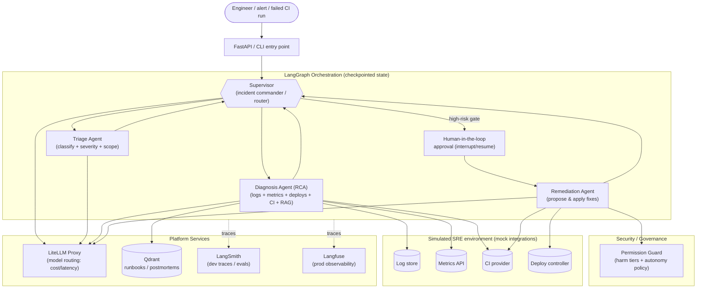
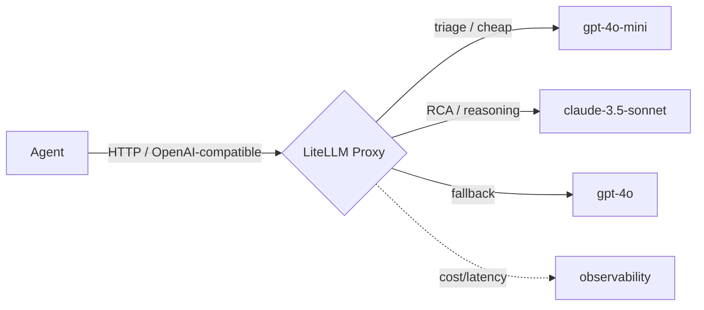

# 🧠 SRE Incident Copilot — a production-shaped multi-agent AI system

A **multi-agent AI system** that triages, diagnoses, and (with human approval) remediates
**CI failures and production incidents**. It exists to demonstrate, end-to-end, how a *real* agentic
system is engineered — not a notebook demo:

**LangGraph supervisor orchestration · dynamic sub-agents · RAG over runbooks · a self-hosted AI
gateway (LiteLLM) · risk-based tool security with human-in-the-loop · observability (LangSmith +
Langfuse) · and a two-layer testing strategy (deterministic `pytest` + LLM-as-judge).**

> **Design philosophy: reliability, not demo-ware.** Anyone can wire an LLM to a tool. The hard part —
> and the part this repo focuses on — is making it *safe, observable, testable, and swappable*. Every
> decision below is made through that lens.

> 🧪 **Runs fully offline.** There is no real cluster behind this. It ships a **simulated SRE
> environment** (mock log store, metrics API, CI provider, deploy controller) seeded from YAML incident
> scenarios. Clone it, add one API key, and run a full incident — no Kubernetes, no cloud. The whole
> test + eval suite is deterministic and reproducible.

---

## 📋 Table of contents

- [What it demonstrates](#-what-it-demonstrates)
- [Verified results](#-verified-results-live-runs)
- [The minimum reliability matrix](#-the-minimum-reliability-matrix)
- [Architecture](#️-architecture)
- [Model gateway & governance (LiteLLM)](#-model-gateway--governance-litellm)
- [Retrieval-Augmented Generation](#-retrieval-augmented-generation-rag)
- [Tool safety (harm tiers + HITL)](#-tool-safety-classify-tool-calls-by-potential-harm)
- [Observability](#-observability-langsmith--langfuse)
- [Testing & evaluation](#-testing--evaluation)
- [HTTP API](#-http-api-interactive-entry-point)
- [Quickstart — run & test it](#-quickstart--run--test-it)
- [Project structure](#️-project-structure)
- [Key design decisions & trade-offs](#-key-design-decisions--trade-offs)

---

## ✨ What it demonstrates

| Capability | Technology | Why it's here |
|---|---|---|
| **Multi-agent orchestration** | [LangGraph](https://langchain-ai.github.io/langgraph/) | A **supervisor** (incident commander) routes to specialized sub-agents with a shared, checkpointed state. |
| **Dynamic agents** | YAML registry + factory | Agents (prompt + tools + model tier) are declared in `agents.yaml` and built at runtime — add one without touching Python. |
| **Retrieval-Augmented Generation** | [Qdrant](https://qdrant.tech/) + [fastembed](https://github.com/qdrant/fastembed) | Grounds diagnosis in real runbooks/postmortems; local ONNX embeddings mean **no embedding API key**. |
| **AI gateway & governance** | [LiteLLM](https://docs.litellm.ai/) | One OpenAI-compatible endpoint that **routes by cost/latency**, with fallbacks, budgets, and **no token markup**. |
| **Risk-based security** | Custom permission guard + human-in-the-loop | Tools are classified by **potential harm** (5 tiers); autonomy is granted per tier, high-risk actions pause for approval. |
| **Observability** | [LangSmith](https://docs.smith.langchain.com/) + [Langfuse](https://langfuse.com/) | Config-gated tracing of every agent step, tool call, token, cost, and latency. |
| **Testing** | `pytest` + **LLM-as-judge** | Deterministic tests for *mechanics*; an LLM judge for *quality*. Different risks, both covered. |
| **Interactive API** | [FastAPI](https://fastapi.tiangolo.com/) | Drive incidents over HTTP: start a scenario, approve a high-risk step, read the audit, run the eval. |

---

## ✅ Verified results (live runs)

Two full incidents driven end-to-end through the HTTP API against real models (via the gateway), then
graded by the LLM-as-judge:

| Scenario | Diagnosis root cause found | Safe action taken | LLM-judge |
|---|---|---|---|
| `checkout-5xx-spike` | ✅ deploy v1.5.0 / commit c3a9 (NullPointerException) | ✅ rollback to v1.4.3 + mitigate + note | **5.0 / 5 — pass** |
| `db-connection-pool-exhaustion` | ✅ deploy v2.2.0 / commit b7c2 (connection leak) | ⚠️ occasionally escalates instead of rolling back | root-cause 5/5, overall ~4.0 |

> The judge **discriminates quality** rather than rubber-stamping — it correctly flags a weaker run.
> That's the whole point of having evals: *without a criterion, every pretty demo looks like progress.*

---

## 🧱 The minimum reliability matrix

Before "which framework?", an agentic system must answer five reliability questions. This matrix is the
backbone of the whole repo — the checklist that turns the conversation from *tool* into *architecture*.

| Dimension | Requirement | Where it lives |
|---|---|---|
| **Context** | The agent gets *what it needs, not everything* | RAG retrieval + scoped prompts (`app/rag`, `app/agents`) |
| **Actions** | Tool calls are *safe* | Harm-tier classification + permission guard (`app/security`, `app/tools`) |
| **State** | Progress is *persisted & resumable* | LangGraph checkpointer + incident state (`app/graph`) |
| **Observability** | A trace per *decision, cost, and failure* | LangSmith + Langfuse (`app/observability`) |
| **Evaluation** | *LLM-judge + deterministic tests* | `tests/unit` + `tests/evals` + `app/eval` |

---

## 🏛️ Architecture

### High-level: Supervisor + specialized incident agents



### Why a Supervisor architecture?

Patterns evaluated (all valid LangGraph shapes):

- **Single ReAct agent** — simplest, but one mega-prompt with many tools becomes brittle and unevaluable.
- **Network (any-to-any handoff)** — flexible, but routing is implicit and hard to govern/observe.
- **Hierarchical teams** — powerful, but overkill for this scope.
- ✅ **Supervisor + dynamic sub-agents** — one orchestrator owns routing, giving **clear traces,
  explicit control over tool risk, and on-demand specialized agents**. Each sub-agent is a small,
  narrowly-scoped ReAct agent.

### The lean team (3 dynamic agents)

Defined entirely in [`app/agents/agents.yaml`](app/agents/agents.yaml) — prompt, tools, and model tier:

| Agent | Model tier | Responsibility | Tools (harm tier) |
|---|---|---|---|
| **Triage** | `fast` | Classify severity/scope, decide what to investigate | get incident, alerts, metrics, recent deploys (🟢) |
| **Diagnosis (RCA)** | `reasoning` | Correlate logs/metrics/deploys/CI/commits + runbooks | query logs/metrics, list deploys, CI runs & logs, commits, git blame, search runbooks (🟢) |
| **Remediation** | `reasoning` | Propose and (when approved) apply the fix | note (🔵), rerun CI (🟡), restart/scale (🟠), rollback/failover (🔴) |

**"Dynamic"** means adding a capability (e.g. a dedicated Metrics agent) is *registering a spec*, not
rewiring the graph.

---

## 🔌 Model Gateway & Governance (LiteLLM)

Every model call goes through a **self-hosted LiteLLM proxy** over one OpenAI-compatible HTTP endpoint.
Agents ask for a model by **tier** (`fast` / `reasoning`), never a vendor — the gateway owns the policy.



What the gateway buys us (all config, zero agent code):

- **Cost/latency-aware routing** — cheap model for triage, stronger model for root-cause analysis.
- **Fallbacks & retries** — a down/slow provider fails over automatically.
- **Budgets & rate limits** — hard guardrails on spend (one line in `litellm.config.yaml`).
- **One credential surface** — the app holds only the gateway key; provider keys live in the gateway.

### Two keys, by design (a common point of confusion)

```
your app ──[ LITELLM_API_KEY ]──▶ LiteLLM gateway ──[ OPENAI_API_KEY ]──▶ provider
        auth: "may I use the gateway?"          auth: "gateway pays the provider"
```

The gateway is a **router, not a model** — it still needs a provider key to generate tokens. (A hosted
gateway like **Portkey/OpenRouter** gives a single key because *they* front the provider billing and
take a cut. Self-hosted LiteLLM = no markup, full control, runs offline.)

### Smart provider selection (implemented)

The gateway client [`app/gateway/client.py`](app/gateway/client.py) picks the model group by whether an
Anthropic key is present:

- **`ANTHROPIC_API_KEY` set** → reasoning tier uses **Claude 3.5 Sonnet** (stronger at multi-step RCA).
- **OpenAI key only** → reasoning tier uses **GPT-4o**, with *no* wasted failed Anthropic calls.

> **Impact:** add an Anthropic key and the reasoning tier **auto-upgrades to Claude with zero code
> change**; remove it and everything keeps working on OpenAI alone. (See the `FUTURE` note in
> `app/gateway/client.py` and the policy comment in `litellm.config.yaml`.)

> **Trend context:** the AI-gateway pattern (LiteLLM, Portkey, OpenRouter, Cloudflare/Vercel AI
> Gateway) is now standard practice — it decouples app code from the fast-moving model market, enables
> per-request cost/latency routing, and centralizes governance/observability. This repo implements the
> pattern the way production teams do.

---

## 📚 Retrieval-Augmented Generation (RAG)

**Why RAG here?** Live tools tell the agent *what is happening now*; RAG tells it *what the organization
already knows about how to handle it*. An LLM has never seen your private runbooks — RAG injects them on
demand:

- **Grounded, safe recommendations.** A 🔴 rollback is proposed from a *documented, approved* procedure,
  and the agent can cite *"per runbook `checkout-payment-5xx`, roll back the deploy"* instead of guessing.
- **Institutional memory.** Postmortems surface prior fixes (*"we've seen this NullPointer-after-deploy
  before"*).
- **Freshness without retraining.** Edit a markdown runbook, re-index — knowledge updates instantly.
- **Cost/context efficiency.** Retrieve the 2–3 relevant runbooks per query, not the whole corpus.
- **Auditability.** Traces record *which* runbook the agent followed — straight into evals.

**How it's built:** Qdrant (Docker for real use, **in-memory** for tests) · corpus in `data/runbooks/` ·
local **fastembed** ONNX embeddings behind an injected `Embedder` protocol (deterministic offline
embedder in tests) · semantic search exposed to Diagnosis as the `search_runbooks` tool · groundedness
**measured by the LLM-judge**.

---

## 🔒 Tool Safety: classify tool calls by potential harm

The core principle: **autonomy is earned per tool, based on how much damage a wrong call can do.** Every
tool carries a `harm_tier`; each tier maps to an autonomy level enforced *before* execution.

| Harm tier | Incident examples | Autonomy granted |
|---|---|---|
| 🟢 **Read-only** | query logs/metrics, list deploys, search runbooks | **High** — execute freely |
| 🔵 **Reversible** | post an incident note | **Autonomy + audit log** |
| 🟡 **Compensable** | rerun a CI job | **Contextual confirmation** |
| 🟠 **Irreversible** | restart / scale a service | **Human-in-the-loop approval** |
| 🔴 **Critical** | **rollback prod, failover, delete data** | **No unattended autonomy** — requires explicit human approval |

Mechanics ([`app/security`](app/security)):

- A **Permission Guard** wraps every tool call, reads its `harm_tier`, and enforces the policy before running it.
- 🟠/🔴 actions trigger a **LangGraph `interrupt()`** — the graph pauses, surfaces an approval request,
  and **resumes** on `Command(resume=...)`. Because state is checkpointed, this works *across HTTP requests*.
- Every allow/deny/approval decision is recorded in an **audit log** (visible via the API).

> This reframes "permissions" from *who is allowed* to *how much damage is possible* — the right axis
> when the actor is an LLM, not a human role.

---

## 🔭 Observability (LangSmith + Langfuse)

Both integrations are **wired and config-gated** (`app/observability/tracing.py`), each with a distinct role:

- **LangSmith** — the **dev & evaluation loop**. First-class LangGraph tracing with near-zero setup
  (just env vars); auto-traces every run.
- **Langfuse** — **self-hostable production observability**. Attached via a LangChain callback handler,
  so traces/cost dashboards are fully owned and not tied to one SaaS.

They're **off by default** and enabled purely by configuration — the app guards them behind
`settings.langsmith_ready` / `settings.langfuse_ready`, so the system runs (and tests stay offline) with
no keys. Turn either on by setting its env vars:

```bash
# LangSmith
LANGSMITH_TRACING=true
LANGSMITH_API_KEY=ls-...
# Langfuse (self-hosted or cloud)
LANGFUSE_ENABLED=true
LANGFUSE_PUBLIC_KEY=pk-...
LANGFUSE_SECRET_KEY=sk-...
LANGFUSE_HOST=https://cloud.langfuse.com
```

> Design note: `runnable_config()` bundles the trace callbacks + checkpointer `thread_id` into one run
> config, so enabling observability never touches graph or agent code.

---

## 🧪 Testing & Evaluation

**An LLM judge does not replace tests — it covers a different risk.** Deterministic tests protect the
*mechanics* (does it act safely?); the judge protects the *quality* (is the RCA actually good?).

| Layer | What it covers |
|---|---|
| **Deterministic (`pytest`)** | Contracts, schemas, **harm-tier permissions** (*"never rolls back prod without approval"*), the mock env, RAG retrieval, graph routing, HITL pause/resume, and the API flow. 66 tests, no LLM calls. |
| **LLM-as-judge (`app/eval`)** | Grades findings vs. each scenario's ground truth on **root-cause correctness, remediation safety** (a forbidden action forces a score of 1), and **groundedness**. The judge is an injectable `Runnable`, so its plumbing is unit-tested offline. |

```bash
pytest                                                   # all 66 deterministic tests (offline)
python -m app.eval.run_eval --scenario data/scenarios/checkout-5xx-spike.yaml   # LLM-as-judge (needs a key)
```

> **Golden rule:** *without an evaluation criterion, any pretty demo looks like an improvement.* Every
> change is measured against the incident dataset, not vibes.

---

## 🌐 HTTP API (interactive entry point)

[`app/api/server.py`](app/api/server.py) is a thin FastAPI driver over the same composition root — it
lets you *interact* with the copilot, including approving high-risk steps over HTTP.

| Method & path | Purpose |
|---|---|
| `GET /healthz` | Liveness |
| `GET /scenarios` | List seeded incidents you can run |
| `POST /incidents` | Start an incident from a `scenario_id` (runs to completion **or** first approval gate) |
| `GET /incidents/{id}` | Status, findings, audit trail, pending approval |
| `POST /incidents/{id}/approve` | Approve/reject a paused high-risk step (HITL resume) |
| `GET /incidents/{id}/audit` | Full harm-tier audit trail |
| `POST /incidents/{id}/eval` | Grade the run with the LLM-as-judge |

Robust error mapping: provider/gateway failures return a clean **`502`** (or **`503`** if the gateway is
unreachable) instead of a raw 500. Interactive docs are auto-generated at `/docs`.

```bash
uvicorn app.api.server:app --reload
./scripts/api_demo.sh    # full curl walkthrough: list → start → approve → audit → eval
```

---

## 🚀 Quickstart — run & test it

> Requires **Python 3.11+** and Docker.

```bash
# 1. Environment
python3.11 -m venv .venv && source .venv/bin/activate
pip install -r requirements.txt -r requirements-dev.txt

# 2. Keys — set OPENAI_API_KEY (ANTHROPIC_API_KEY optional; enables Claude for RCA)
cp .env.example .env    # then edit .env

# 3. Platform services (Qdrant + LiteLLM gateway)
docker compose up -d
#   NOTE: after editing provider keys in .env, RECREATE the gateway so it reloads them:
#         docker compose up -d --force-recreate litellm

# 4a. Run an incident via the CLI
python -m app.main --scenario data/scenarios/checkout-5xx-spike.yaml --auto-approve

# 4b. …or via the HTTP API
uvicorn app.api.server:app --reload      # in one terminal
./scripts/api_demo.sh                     # in another (needs `jq`)

# 5. Evaluate a run with the LLM-as-judge
python -m app.eval.run_eval --scenario data/scenarios/checkout-5xx-spike.yaml

# 6. Deterministic test suite (fully offline, no keys)
pytest
```

**Seeded scenarios** (`data/scenarios/`): `checkout-5xx-spike`, `db-connection-pool-exhaustion`,
`cdn-latency-spike` — each with logs, metrics, CI, commits, deploys, and a ground-truth `expected` block.

---

## 🗂️ Project structure

```
multi-agent-ai/
├── app/
│   ├── domain/            # core entities: Incident, Severity, HarmTier, ToolResult
│   ├── integrations/      # SIMULATED SRE env: protocols + in-memory mock + DTOs
│   ├── rag/               # embedder protocol (fastembed) + Qdrant retriever
│   ├── tools/             # LangChain tools wrapping the env/RAG, tagged with harm tiers
│   ├── security/          # harm-tier policy + permission guard + approval context
│   ├── agents/            # agents.yaml registry + dynamic sub-agent factory
│   ├── graph/             # supervisor StateGraph, incident state, checkpointer, HITL
│   ├── gateway/           # LiteLLM client (tier → model, Anthropic-preferring)
│   ├── observability/     # LangSmith + Langfuse wiring (config-gated)
│   ├── eval/              # LLM-as-judge core + eval CLI
│   ├── api/               # FastAPI app: schemas, session service, routes
│   ├── composition.py     # composition root (DI): wires every layer together
│   ├── main.py            # CLI entry point
│   └── config.py          # typed settings (pydantic-settings)
├── data/
│   ├── runbooks/          # runbooks / postmortems for RAG
│   └── scenarios/         # seeded incidents + ground-truth expectations
├── tests/
│   ├── unit/              # deterministic tests (domain → API)
│   └── evals/             # LLM-as-judge tests (offline via stub judge)
├── scripts/api_demo.sh    # end-to-end curl walkthrough of the API
├── litellm.config.yaml    # gateway routing rules (tiers, fallbacks, budgets)
├── docker-compose.yml     # Qdrant + LiteLLM
├── requirements*.txt      # runtime + dev dependencies (pinned by major)
└── .env.example
```

Layered, bottom-up (domain → integrations → tools → security → agents → graph → observability → entry
points), each layer unit-tested in isolation and depending only on the layer below via **protocols**, so
the mock SRE env or the embedder can be swapped for real implementations without touching upstream code.

---

## 🧭 Key design decisions & trade-offs

| Decision | Why | Trade-off / note |
|---|---|---|
| **Supervisor over network/hierarchical** | Explicit routing → clear traces + governable tool risk | Slightly less "emergent" than any-to-any handoff |
| **Self-hosted LiteLLM** over Portkey/OpenRouter | No markup, offline, full control, best portfolio signal | You manage provider keys yourself (two-key model) |
| **Anthropic-preferring reasoning, GPT fallback** | Claude is stronger at multi-step RCA; still runs on OpenAI alone | Auto-selected by key presence — no code change to switch |
| **Harm tiers over role-based perms** | The actor is an LLM; *damage potential* is the right axis | Requires classifying every tool |
| **HITL via LangGraph `interrupt` + checkpointer** | Pausable/resumable across HTTP requests; auditable | Needs a session store keyed by `thread_id` |
| **Local fastembed embeddings** | RAG works with no embedding API/key; deterministic tests | Slightly lower recall than large hosted embedders |
| **Deterministic tests *and* LLM-judge** | They cover different risks (mechanics vs. quality) | Judge runs need a model key |
| **Config-gated observability** | Runs/tests offline by default; enable per env | Two backends overlap (intentional, to showcase both) |

---

## 🧰 Tech stack

Python 3.11+ · LangGraph (+ LangChain core) · LiteLLM (self-hosted gateway) · OpenAI / Anthropic (via
gateway) · Qdrant + fastembed (RAG) · FastAPI + Uvicorn · LangSmith + Langfuse (observability) ·
pydantic-settings · pytest + LLM-as-judge · Docker Compose.

---

## 🗺️ Status

- [x] Simulated SRE environment (mock log/metrics/CI/deploy integrations + seeded scenarios)
- [x] LiteLLM gateway + cost/latency routing (`litellm.config.yaml`) with key-aware provider selection
- [x] RAG retrieval over runbooks/postmortems (Qdrant + fastembed)
- [x] Supervisor graph + dynamic sub-agent factory (Triage → Diagnosis → Remediation)
- [x] Harm-tier classification + permission guard + human-in-the-loop approval
- [x] State persistence (LangGraph checkpointer) for resumable incidents
- [x] Observability wiring across the graph (LangSmith + Langfuse), config-gated
- [x] Deterministic test suite (contracts, permissions, RAG, graph, API) — 66 tests
- [x] LLM-as-judge evaluation harness + CLI
- [x] FastAPI HTTP entry point + curl demo
- [ ] Optional: enable LangSmith/Langfuse dashboards in a hosted deploy
- [ ] Optional: stronger diagnosis→remediation handoff for consistent auto-remediation
