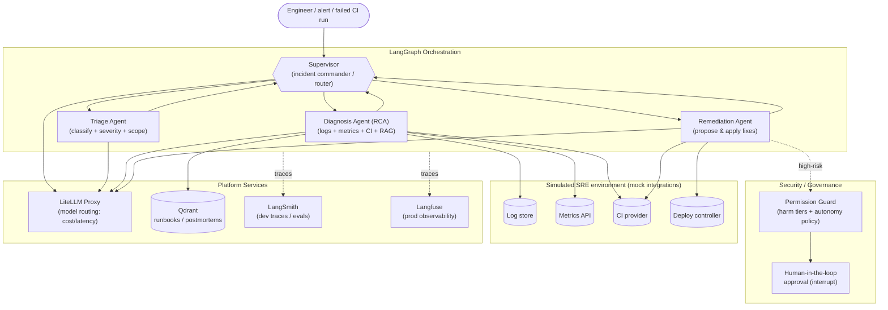
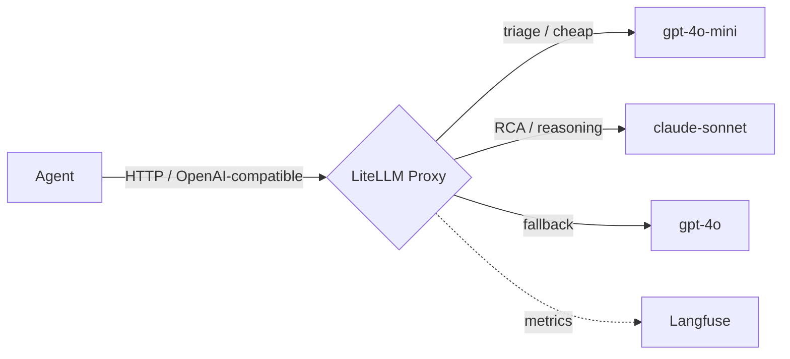

# 🧠 Multi-Agent AI — SRE Incident Copilot

A reference implementation of a **production-shaped multi-agent AI system**: an assistant that helps
engineers diagnose and resolve **CI failures and production incidents**. Built to demonstrate modern
agent engineering end-to-end: orchestration, RAG, observability, model routing/governance,
risk-based security, and a real testing strategy (deterministic **and** LLM-as-judge).

> This project is deliberately designed around a **reliability mindset**, not a demo mindset.
> The guiding idea throughout: *the things below are what turn the conversation from "which tool?"
> into "what architecture?"* — see [The minimum reliability matrix](#-the-minimum-reliability-matrix).

> **Why incident response as the domain?** Business context is a vehicle, not the point — but this one
> is an *ideal* vehicle. It naturally exercises every capability we want to showcase: knowledge
> retrieval (runbooks/postmortems), multi-source diagnosis (logs, metrics, CI, git), **long-running
> stateful workflows**, and **high-stakes actions that must be gated** (you do not let an LLM roll back
> a production deploy unsupervised). The focus of this repo is the **technology and how to build a
> system like this**.

> 🧪 **Runs fully offline.** There is no real cluster behind this. We ship a **simulated SRE
> environment** — mock integrations (log store, metrics API, CI provider, deploy controller) backed by
> seeded incident scenarios. Any reviewer can clone and run it with no infrastructure, and it makes the
> tests + evaluations **fully reproducible**.

---

## ✨ What this project demonstrates

| Capability | Technology | Why it's here |
|---|---|---|
| **Multi-agent orchestration** | [LangGraph](https://langchain-ai.github.io/langgraph/) | A **supervisor** (incident commander) dynamically routes to specialized sub-agents. |
| **Retrieval-Augmented Generation** | [Qdrant](https://qdrant.tech/) + embeddings | Grounds diagnosis in runbooks, postmortems, and past incidents. |
| **Observability / tracing** | [LangSmith](https://docs.smith.langchain.com/) + [Langfuse](https://langfuse.com/) | Full trace of every agent step, tool call, token, cost, and latency. **LangSmith** drives the dev/eval loop; **Langfuse** provides self-hosted production observability. |
| **Model gateway & governance** | [LiteLLM](https://docs.litellm.ai/) | One OpenAI-compatible HTTP endpoint that **routes to models by cost/latency rules**, with fallbacks, budgets & rate limits. Open-source, self-hosted, **no token markup**. |
| **Risk-based security** | Custom permission layer + human-in-the-loop | Tools are classified by **potential harm** (5 tiers); autonomy is granted per tier. |
| **Testing** | `pytest` + **LLM-as-judge** | Deterministic tests *and* evaluation of diagnosis quality — they cover different risks. |

---

## 🧱 The minimum reliability matrix

Before "which framework?", an agentic system needs to answer five reliability questions. This matrix
is the backbone the whole project is built around — **it's the checklist that turns the conversation
from *tool* into *architecture*.**

| Dimension | Requirement | Where it lives in this repo |
|---|---|---|
| **Context** | The agent receives *what it needs, not everything* | RAG retrieval + scoped prompts (`app/rag`, `app/agents`) |
| **Actions** | Tool calls are *safe* | Harm-tier classification + permission guard (`app/security`, `app/tools`) |
| **State** | Memory and progress are *persisted* | LangGraph checkpointer / incident state (`app/graph`) |
| **Observability** | A trace per *decision, cost, and failure* | LangSmith + Langfuse (`app/observability`) |
| **Evaluation** | *LLM-judge + deterministic tests* | LangSmith datasets/experiments + `tests/unit` + `tests/evals` |

---

## 🏛️ Architecture

### High-level: Supervisor + specialized incident agents



### Why a Supervisor architecture?

We evaluated the common LangGraph patterns:

- **Single ReAct agent** — simplest, but one mega-prompt with many tools becomes brittle and hard to evaluate.
- **Network (any-to-any handoff)** — flexible, but routing is implicit and hard to govern/observe.
- **Hierarchical teams** — powerful, but overkill for this scope.
- ✅ **Supervisor + dynamic sub-agents** — a single orchestrator (the "incident commander") owns
  routing, which gives us **clear traces, explicit control over tool risk, and the ability to spawn
  specialized agents on demand**. Each sub-agent is a small ReAct agent with a *narrow*, well-tested toolset.

**The lean v1 team (3 agents):**

| Agent | Responsibility | Representative tools (harm tier) |
|---|---|---|
| **Triage** | Classify the incident, assign severity, decide what to investigate | read alert, list recent deploys (🟢) |
| **Diagnosis (RCA)** | Correlate logs/metrics/CI + retrieve runbooks to hypothesize root cause | query logs, query metrics, get CI run, git blame, search runbooks (🟢) |
| **Remediation** | Propose and (when approved) apply a fix | comment on incident (🔵), rerun CI job (🟡), restart/scale service (🟠), rollback deploy (🔴) |

**"Dynamic agents"** means sub-agents are constructed at runtime from a registry (tools + system prompt +
model tier), so adding a capability (e.g. a dedicated Metrics agent later) = registering a spec, not
rewiring the graph.

---

## 🔌 Model Gateway & Governance (LiteLLM)

Instead of calling OpenAI/Anthropic SDKs directly, **every model call goes through a LiteLLM proxy**
via a single OpenAI-compatible HTTP endpoint. The gateway owns the policy (defined as config), so
agents never hardcode a provider:

- **Cost/latency-aware routing** — cheap+fast model for **triage/classification**, stronger reasoning
  model for **root-cause analysis**.
- **Fallbacks & retries** — if a provider is down or slow, automatically fail over.
- **Load balancing** — spread traffic across providers/keys.
- **Budgets & rate limits** — hard guardrails on spend and throughput.



**Why LiteLLM:** it's open-source, self-hosted, and adds **no markup on token cost** (you pay the
providers directly — the gateway just applies your rules). It's also the most widely adopted gateway
among engineers and runs locally with zero signup, so reviewers can clone and run this repo for free.

> Alternatives considered: **Portkey** (hosted dashboard, strong governance) and ML routers like
> **Not Diamond / Martian**. The gateway is abstracted behind one client (`app/gateway/`), so swapping
> vendors is a config change, not a rewrite.

---

## 📚 Retrieval-Augmented Generation (RAG)

**Why RAG here?** The live tools (logs, metrics, CI) tell the agent *what is happening right now*; RAG
tells it *what the organization already knows about how to handle it*. An LLM has never seen your private
runbooks, postmortems, or service ownership — RAG injects that knowledge on demand. Concretely it gives
the copilot five advantages:

- **Grounded, safe recommendations.** High-stakes actions (e.g. a 🔴 production rollback) are proposed
  from a **documented, approved procedure**, not invented — the agent can cite *"per runbook
  `checkout-payment-5xx`, roll back the deploy"* instead of guessing.
- **Institutional memory.** Past postmortems surface prior fixes: *"we've seen this NullPointer-after-deploy
  before — the fix was a rollback."*
- **Freshness without retraining.** Update a markdown runbook and re-index; the agent's knowledge updates
  instantly. No fine-tuning.
- **Context efficiency & cost.** Retrieve only the 2–3 relevant runbooks per query instead of stuffing
  everything into the prompt.
- **Auditability.** Because specific documents are retrieved, traces record *which* runbook the agent
  followed — feeding straight into observability and evals.

**How it's built**

- **Vector store:** Qdrant — runs as a Docker service for real use, and **in-memory (`:memory:`)** for
  tests so the suite needs no infrastructure.
- **Corpus:** runbooks & postmortems in `data/runbooks/` (e.g. a checkout-5xx runbook that prescribes the
  *safe* action and explicitly warns against the unsafe one).
- **Embeddings:** local **fastembed** ONNX model (no embedding API/key required). The embedder is injected
  behind an `Embedder` protocol, so tests use a deterministic offline embedder while runtime uses fastembed.
- **Retrieval:** semantic search returning scored, typed `RetrievedDoc`s, exposed to the **Diagnosis
  agent** as the `search_runbooks` tool.
- **Grounding:** root-cause hypotheses cite the retrieved runbook; un-grounded claims are discouraged by
  prompt and **measured by the LLM-as-judge eval suite** (groundedness score).

> Net effect: without RAG the copilot is a smart generalist *guessing* at your infra; with RAG it behaves
> like an engineer who has read every runbook and postmortem — which is what makes its diagnosis both
> **correct and safe**.

---

## 🔒 Tool Safety: classify tool calls by potential harm

The core security principle: **autonomy is earned per tool, based on how much damage a wrong call can do.**
Every tool is annotated with a **harm tier**, and each tier maps to an **autonomy level**. The supervisor
can never let a sub-agent execute a tool with more autonomy than its tier permits. In an incident tool,
this is not academic — the difference between "read logs" and "roll back prod" is the whole game.

| Harm tier | Incident examples | Autonomy granted |
|---|---|---|
| 🟢 **Read-only** | query logs/metrics, get CI run, search runbooks | **High autonomy** — execute freely |
| 🔵 **Reversible** | post a comment / draft an incident note | **Autonomy with logging** |
| 🟡 **Compensable** | rerun a CI job, re-trigger a pipeline | **Contextual confirmation** |
| 🟠 **Irreversible** | restart / scale a service, kill a pod | **Human-in-the-loop** |
| 🔴 **Catastrophic** | **rollback a prod deploy, failover, delete data** | **No direct autonomy** (propose/escalate only) |

Mechanics:
- A **Permission Guard** wraps every tool call, looks up the tool's `harm_tier`, and enforces the
  matching autonomy policy *before* execution.
- 🔵 **Reversible** actions execute but emit an audit log; 🟡 **Compensable** actions require a contextual
  confirmation; 🟠 **Irreversible** actions trigger a **LangGraph `interrupt`** (human approval);
  🔴 **Catastrophic** actions are never executed autonomously — they can only be proposed/escalated.
- Every allow/deny/approval decision is recorded as an observability event for auditability.

> This reframes "permissions" from *who is allowed* to *how much damage is possible* — which is the
> right axis for agentic systems, where the actor is an LLM, not a human role.

---

## 🔭 Observability (LangSmith + Langfuse)

Both tools capture the **full execution tree**: supervisor decisions, each sub-agent, every tool call,
retrieved chunks, model used (from the gateway), tokens, cost, and latency per step. They overlap by
design — in a real project you'd often pick one — but here each owns a distinct role to showcase both:

- **LangSmith** — the **development & evaluation loop**. First-class LangGraph/LangChain tracing with
  near-zero setup (just env vars), plus **datasets and `evaluate()` experiments** that power the
  LLM-as-judge suite and let you compare runs over time.
- **Langfuse** — **self-hostable production observability**. Vendor-neutral, fully owned traces and
  cost/latency dashboards (wired via a callback handler), so the deployment isn't tied to one SaaS.

> Tracing is enabled by configuration, not code changes — flip env vars to turn either backend on/off.

---

## 🧪 Testing & Evaluation

**An LLM judge does not replace tests — it covers a different kind of risk.** Deterministic tests
protect the *mechanics* (does the system act safely); the LLM judge protects the *quality* (is the
root-cause analysis actually good). You need both.

| Layer | What it covers |
|---|---|
| **Deterministic tests (`pytest`)** | Contracts, schemas, **permissions/harm tiers** (e.g. *"never rolls back prod without approval"*), retries, timeouts, idempotency, and the mock integrations. Fast, no LLM calls. |
| **LLM-as-judge** | Diagnosis quality: correctness vs known root cause, groundedness in runbooks, completeness, and tone. Run as **LangSmith `evaluate()` experiments**. |
| **Datasets** | **Seeded incident scenarios** with known root causes & expected safe actions, versioned in **LangSmith** (mirrored to Langfuse for prod scoring). |

> **Golden rule:** *without an evaluation criterion, any pretty demo looks like an improvement.*
> Every change is measured against the incident dataset, not vibes.

```bash
pytest tests/unit            # deterministic
pytest tests/evals -m judge  # LLM-as-judge (requires model keys + dataset)
```

---

## 🗂️ Planned project structure

```
multi-agent-ai/
├── app/
│   ├── agents/            # agents.yaml registry + dynamic sub-agent factory (triage/diagnosis/remediation)
│   ├── graph/             # LangGraph wiring, incident state, checkpointer, interrupts
│   ├── tools/             # tools, each tagged with a harm tier
│   ├── integrations/      # SIMULATED SRE env: log store, metrics, CI, deploy controller (mock)
│   ├── rag/               # ingestion + retrieval (Qdrant)
│   ├── gateway/           # LiteLLM client + routing config
│   ├── security/          # permission guard, harm tiers, HITL
│   ├── observability/     # LangSmith + Langfuse setup + callbacks
│   └── config.py          # settings (pydantic-settings)
├── data/
│   ├── runbooks/          # sample runbooks / postmortems for RAG
│   └── scenarios/         # seeded incidents (logs, metrics, CI runs) + known root causes
├── tests/
│   ├── unit/
│   └── evals/             # LLM-as-judge + datasets
├── litellm.config.yaml    # gateway routing rules (models, fallbacks, budgets)
├── docker-compose.yml     # Qdrant + LiteLLM (+ optional self-hosted Langfuse)
├── requirements.txt       # runtime dependencies (pinned by major)
├── requirements-dev.txt   # test/lint/type-check tooling
├── .env.example
└── README.md
```

---

## 🚀 Getting started (planned)

> ⚠️ Requires **Python 3.11+** (the current `.venv` is 3.9 and will be recreated).

```bash
# 1. Environment
cp .env.example .env          # add OPENAI / ANTHROPIC / LANGSMITH / LANGFUSE keys
python3.11 -m venv .venv && source .venv/bin/activate
pip install -r requirements.txt -r requirements-dev.txt   # or: pip install -r requirements.txt

# 2. Infra (Qdrant + LiteLLM gateway, optional self-hosted Langfuse)
docker compose up -d

# 3. Seed the knowledge base (runbooks / postmortems)
python -m app.rag.ingest

# 4. Run an incident scenario through the copilot
python -m app.main --scenario data/scenarios/checkout-5xx-spike.yaml
```

---

## 🧰 Tech stack summary

- **Language:** Python 3.11+
- **Orchestration:** LangGraph (+ LangChain core)
- **Model gateway/routing:** LiteLLM (self-hosted, OpenAI-compatible)
- **LLM providers:** OpenAI + Anthropic (via the gateway)
- **RAG / vector store:** Qdrant
- **Observability & evals:** LangSmith (dev/eval) + Langfuse (self-hosted prod)
- **Config:** pydantic-settings
- **Testing:** pytest + LLM-as-judge

---

## 🗺️ Roadmap

- [ ] Scaffold project (pyproject, config, docker-compose)
- [ ] Simulated SRE environment (mock log/metrics/CI/deploy integrations + seeded scenarios)
- [ ] LiteLLM gateway + routing config (`litellm.config.yaml`)
- [ ] RAG ingestion + retrieval over runbooks/postmortems
- [ ] Supervisor graph + dynamic sub-agent factory (Triage → Diagnosis → Remediation)
- [ ] Harm-tier classification + permission guard + human-in-the-loop approval
- [ ] State persistence (LangGraph checkpointer) for resumable incidents
- [ ] Tracing across the graph (decision / cost / failure) — LangSmith + Langfuse
- [ ] Deterministic tests (contracts, schemas, permissions, retries, idempotency)
- [ ] LLM-as-judge evaluation suite + datasets (LangSmith `evaluate()`)
